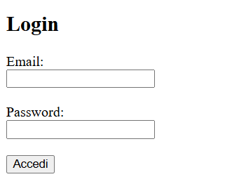
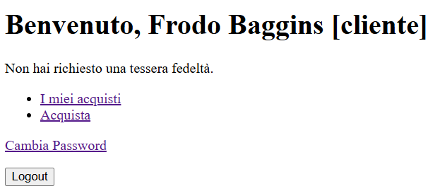
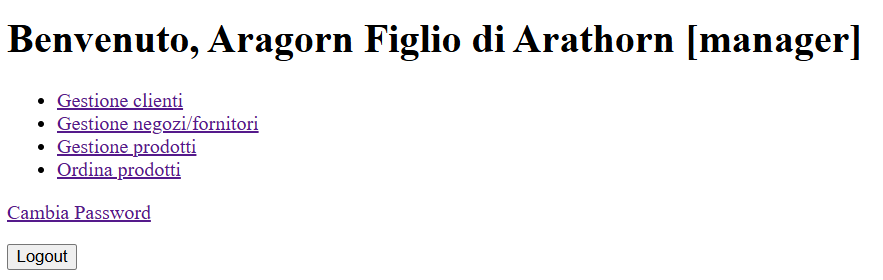

= Progetto Catena Negozi
:doctype: article
:toc: left
:toclevels: 3
:sectnums:

== Introduzione

Questo progetto implementa un sistema di gestione per una catena di negozi, con funzionalità per clienti e manager. Il sistema permette la gestione di clienti, prodotti, negozi, fornitori e ordini.

== Requisiti di sistema

* PostgreSQL 16.x
* PHP 8.x
* Web server (Apache, Nginx, o server integrato PHP)
* Browser web moderno

== Struttura del progetto

* `sql/`: Contiene il dump del database
* `www/`: Contiene i file PHP dell'applicazione web
* `docs/`: Contiene la documentazione del progetto
* `utils/`: Contiene utility per il progetto

I file Python nella directory `utils/py/` sono stati utilizzati solo per lo sviluppo e non sono necessari per il funzionamento dell'applicazione.

== Installazione

=== Configurazione del database

1. Creare l'utente `webapp` necessario per l'applicazione:
+
[source,bash]
----
psql -U postgres -f sql/create_user.sql
----

2. Importare il dump del database PostgreSQL:
+
[source,bash]
----
psql -U postgres -f sql/dump-catena_negozi-202506242113.sql
----

NOTA: È importante creare l'utente `webapp` prima di importare il dump, poiché il dump contiene riferimenti a questo utente e assegna i permessi necessari.

=== Configurazione del web server

1. Configurare il web server per puntare alla directory `www/`
2. Verificare che PHP sia configurato correttamente
3. Verificare le credenziali di connessione al database in `www/config/config.php`

== Accesso al sistema

=== Utenti di test

==== Manager
* Login: gandalf.grigio@valinor.ea
* Password: gandalf.grigio

==== Clienti
* Login: frodo.baggins@contea.tdm
* Password: frodo.baggins

=== Login

1. Accedere alla pagina di login (`login.php`)
2. Inserire email e password
3. Fare clic su "Accedi"

=== Dashboard

==== Dashboard cliente

La dashboard del cliente mostra:

* Informazioni personali
* Saldo punti tessera fedeltà (se disponibile)
* Menu con le funzionalità disponibili

==== Dashboard manager

La dashboard del manager mostra:

* Informazioni personali
* Menu con le funzionalità di gestione

== Risoluzione dei problemi

=== Problemi di connessione al database

1. Controllare le credenziali in `www/config/config.php`
2. Verificare che l'utente `webapp` abbia i permessi necessari

=== Errori di login

1. Verificare che l'email sia corretta
2. Verificare che la password sia corretta
3. Controllare che l'utente esista nel database

