= Documentazione tecnica
:doctype: article
:toc: left
:toclevels: 3
:sectnums:

== Premesse

La presente documentazione descrive il progetto realizzato per il corso di *Basi di Dati* nell’anno accademico 2024/2025.

Il contesto riguarda una catena di *negozi* presso i quali è possibile acquistare *prodotti* di tipologia non specificata. Ogni negozio può effettuare vendite ai *clienti* che ne fanno richiesta. +
I clienti hanno la possibilità di effettuare *acquisti*, richiedere una *tessera fedeltà* per accumulare punti utili allo sblocco di sconti, nonché visualizzare le *fatture* relative ai propri acquisti. +
I *manager* possono gestire i negozi, aggiungere prodotti e definire i prezzi per ciascun punto vendita. +
Essi possono inoltre effettuare ordini verso i *fornitori* per ripristinare la disponibilità dei prodotti in esaurimento. +
Sia clienti che manager devono poter modificare la propria password, mentre solo i manager sono autorizzati a registrare nuove utenze per i clienti.

== Attori principali e relazioni

In questa sezione vengono illustrate le scelte progettuali adottate nella modellazione del dominio, facendo riferimento allo *schema ER* prodotto.

[.text-center]
.Schema ER iniziale
image::diagrams/schema_er_v1.png[align=center,pdfwidth=90%]

Lo schema iniziale evidenzia i principali attori coinvolti e le rispettive relazioni. +
Procedendo da sinistra verso destra, si nota l’entità *Utenza*, utilizzata per registrare le credenziali sia dei clienti sia dei manager. Tali credenziali sono associate in modo univoco a un utente, vincolo garantito da un trigger lato database che sarà analizzato successivamente. +

La relazione tra *Negozio* e *Manager* è di tipo _uno-a-molti_: ogni negozio è gestito da un solo manager, mentre un manager può amministrare più negozi. +
Ciascun negozio possiede i propri orari di apertura e può rilasciare una o più *tessere fedeltà* ai clienti. Tali tessere, pur essendo emesse da un determinato negozio, sono valide in tutta la catena. +
Un negozio può inoltre essere destinatario di uno o più *ordini*.

La relazione tra *Negozio* e *Fornitore* è mediata dagli ordini: ogni ordine è infatti inviato da un fornitore a un negozio e riguarda un singolo *Prodotto*.

[NOTE]
====
L'associazione di un ordine a un solo prodotto è motivata da un preciso requisito dell'applicazione: i manager devono poter inoltrare ordini per un determinato prodotto verso il fornitore che lo offre al prezzo più vantaggioso. +
Permettere a un ordine di includere più prodotti avrebbe comportato una complessità maggiore, trasformando il problema da un semplice confronto di prezzi a un’ottimizzazione globale del costo complessivo dell’ordine.
====

I *prodotti* sono inoltre associati alle *fatture* dei clienti. +
È possibile osservare una chiara somiglianza tra le entità *Fornitore* e *Negozio*: entrambe rappresentano punti di deposito di prodotti, dotati di un indirizzo, in grado di vendere articoli a un determinato prezzo e quantità. +
Per tale ragione è stata introdotta l’entità astratta *Punto Deposito*, posta alla radice di una gerarchia di generalizzazione. A tale livello sono stati definiti gli attributi comuni (come l'indirizzo) e le relazioni relative alla disponibilità e ai prezzi dei prodotti.

A partire da questo schema concettuale è stato prodotto uno *schema ristrutturato*, che mantiene tutte le entità della gerarchia e le connette mediante la relazione *IS_A*. +
Sono inoltre stati ristrutturati alcuni attributi composti, come ad esempio l’attributo _Orari_ dell’entità *Negozio*.

[.text-center]
.Schema ER ristrutturato
image::diagrams/schema_er_v2.png[align=center,pdfwidth=90%]

== Implementazione Database

A partire dallo schema ER ristrutturato, la creazione della struttura del database è quasi automatica. +
Possiamo fare dei commenti sulle tabelle sulla base del diagramma generato da *DBeaver*, ambiente da me usato per costruire
la base di dati:

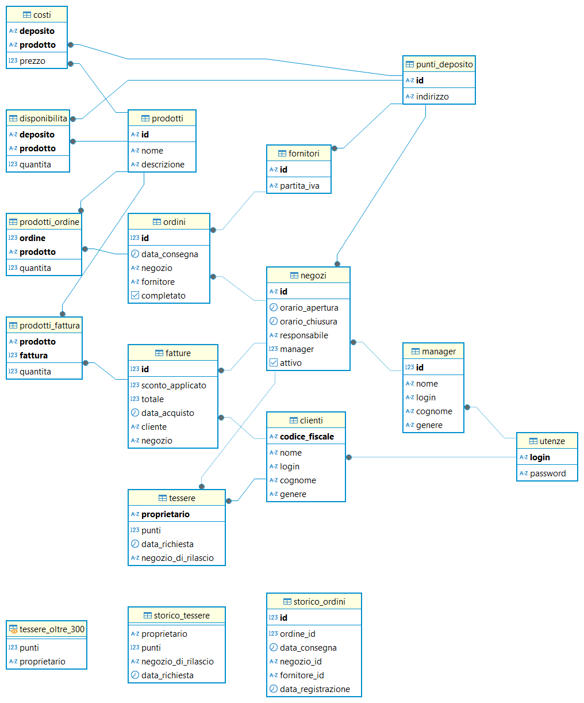

=== Tabelle principali

* *clienti*
** Identificati tramite codice fiscale
** Contiene informazioni anagrafiche (nome, cognome, genere)
** Collegata a utenze per l'accesso

* *utenze*
** Contiene le credenziali di accesso per clienti e manager (login, password)

* *tessere*
** Rilasciate ai clienti
** Traccia dei punti accumulati e del negozio che l’ha emessa
** Implementate come entità debole, la chiave primaria è anche chiave esterna

* *manager*
** Contiene dati personali e login per autenticazione

* *negozi*
** Riferisce al manager responsabile
** Include orari di apertura/chiusura e stato attivo/inattivo

* *prodotti*
** Elenco dei prodotti disponibili (nome, descrizione)

* *punti_deposito*
** Località in cui vengono stoccati i prodotti
** A questa entità si riferiscono le tabelle che riportano i costi e le disponibilità dei prodotti

* *disponibilità*
** Relazione tra deposito e prodotto con quantità disponibili

* *costi*
** Prezzo del prodotto in ciascun deposito

* *fornitori*
** Identificati da id e partita iva

* *ordini*
** Collegati a un fornitore e a un negozio
** Tracciano data di consegna e stato (completato o no)

* *prodotti_ordine*
** Associazione tra ordini e prodotti, con quantità richieste

* *fatture*
** Collegate a un cliente
** Registrano sconto applicato (se presente), totale e data di acquisto

* *prodotti_fattura*
** Relazione molti-a-molti tra fatture e prodotti, con quantità acquistate

=== Tabelle di supporto

* *storico_ordini*
** Tabella con lo storico di tutti gli ordini effettuati, alimentata da un meccanismo attivo lato database

* *storico_tessere*
** Tabella con lo storico di tutte le tessere emesse, alimentata da un meccanismo attivo lato database

* *tessere_oltre_300*
** Vista contenente tutte le tessere con 300 o più punti

== Trigger e funzioni

Il database implementa diversi meccanismi attivi (trigger e funzioni) per garantire l'integrità dei dati, automatizzare operazioni ricorrenti e implementare regole di business complesse. Di seguito sono descritti i principali trigger e le relative funzioni.

=== Sistema di fidelizzazione clienti

[listing]
----
CREATE TRIGGER trigger_aggiorna_punti AFTER INSERT
ON develop.fatture FOR EACH ROW EXECUTE FUNCTION develop.aggiorna_punti();

CREATE OR REPLACE FUNCTION develop.aggiorna_punti()
 RETURNS trigger
 LANGUAGE plpgsql
AS $function$
BEGIN
    UPDATE develop.tessere
    SET punti = punti + FLOOR(NEW.totale)
    WHERE proprietario = NEW.cliente;

    RETURN NULL;
END;
$function$
;
----

Questo trigger implementa il sistema di fidelizzazione clienti, aggiornando automaticamente il saldo punti delle tessere fedeltà. Si attiva dopo l'inserimento di una nuova fattura e incrementa i punti della tessera del cliente in base all'importo speso (arrotondato per difetto). Per ogni euro speso, il cliente guadagna un punto fedeltà.

=== Unicità delle credenziali utente

[listing]
----
CREATE TRIGGER check_login_exclusive_clienti BEFORE
INSERT OR UPDATE
ON develop.clienti FOR EACH ROW EXECUTE FUNCTION develop.check_login_exclusivity();

CREATE TRIGGER check_login_exclusive_manager BEFORE
INSERT OR UPDATE
ON develop.manager FOR EACH ROW EXECUTE FUNCTION develop.check_login_exclusivity();

CREATE OR REPLACE FUNCTION develop.check_login_exclusivity()
 RETURNS trigger
 LANGUAGE plpgsql
AS $function$
BEGIN
    -- Verifica se il login è già presente nell'altra tabella
    IF TG_TABLE_NAME = 'clienti' THEN
        IF EXISTS (SELECT 1 FROM develop.manager WHERE login = NEW.login) THEN
            RAISE EXCEPTION 'Login % già associato a un manager', NEW.login;
        END IF;
    ELSIF TG_TABLE_NAME = 'manager' THEN
        IF EXISTS (SELECT 1 FROM develop.clienti WHERE login = NEW.login) THEN
            RAISE EXCEPTION 'Login % già associato a un cliente', NEW.login;
        END IF;
    END IF;
    RETURN NEW;
END;
$function$
;
----

Questo meccanismo garantisce che le credenziali di accesso (login) siano univoche tra clienti e manager. Poiché le credenziali sono memorizzate in tabelle separate, è necessario un controllo a livello di trigger per assicurare che lo stesso nome utente non possa essere utilizzato contemporaneamente da un cliente e da un manager. Il trigger si attiva prima dell'inserimento o dell'aggiornamento di record nelle tabelle clienti e manager, verificando che il login non sia già presente nell'altra tabella.

=== Storicizzazione delle tessere fedeltà

[listing]
----
CREATE TRIGGER trigger_salva_storico_tessere BEFORE
UPDATE OF attivo
ON develop.negozi FOR EACH ROW EXECUTE FUNCTION develop.salva_storico_tessere();

CREATE OR REPLACE FUNCTION develop.salva_storico_tessere()
 RETURNS trigger
 LANGUAGE plpgsql
AS $function$
BEGIN
    IF OLD.attivo AND NOT NEW.attivo THEN
        INSERT INTO develop.storico_tessere (proprietario, punti, negozio_di_rilascio, data_richiesta)
        SELECT proprietario, punti, negozio_di_rilascio, data_richiesta
        FROM develop.tessere
        WHERE negozio_di_rilascio = OLD.id;
    END IF;

    RETURN NEW;
END;
$function$
;
----

Questo trigger implementa un meccanismo di storicizzazione delle tessere fedeltà quando un negozio viene disattivato. Si attiva prima dell'aggiornamento del campo "attivo" nella tabella negozi e, se il negozio passa da attivo a inattivo, salva nella tabella storico_tessere tutte le tessere emesse da quel negozio. Questo permette di mantenere uno storico completo delle tessere anche dopo la disattivazione di un punto vendita.

=== Tracciamento degli ordini

[listing]
----
CREATE TRIGGER trg_storico_ordini AFTER
INSERT ON develop.ordini
FOR EACH ROW EXECUTE FUNCTION develop.tr_storico_ordini_insert();

CREATE OR REPLACE FUNCTION develop.tr_storico_ordini_insert()
 RETURNS trigger
 LANGUAGE plpgsql
AS $function$
BEGIN
    INSERT INTO develop.storico_ordini (ordine_id, data_consegna, negozio_id, fornitore_id)
    VALUES (NEW.id, NEW.data_consegna, NEW.negozio, NEW.fornitore);

    RETURN NEW;
END;
$function$
;
----

Questo trigger implementa un sistema di tracciamento degli ordini, registrando automaticamente ogni nuovo ordine nella tabella storico_ordini. Si attiva dopo l'inserimento di un nuovo record nella tabella ordini e copia le informazioni principali (ID ordine, data di consegna, negozio e fornitore) nella tabella di storico. Questo permette di mantenere una traccia completa di tutti gli ordini effettuati, anche se dovessero essere modificati o eliminati dalla tabella principale.

=== Aggiornamento disponibilità prodotti

[listing]
----
CREATE TRIGGER trg_completamento_ordine AFTER
UPDATE OF completato ON
    develop.ordini FOR EACH ROW EXECUTE FUNCTION develop.aggiorna_disponibilita_al_completamento();

CREATE OR REPLACE FUNCTION develop.aggiorna_disponibilita_al_completamento()
 RETURNS trigger
 LANGUAGE plpgsql
AS $function$
DECLARE
    r RECORD;
BEGIN
    IF NEW.completato AND NOT OLD.completato THEN
        FOR r IN
            SELECT prodotto, quantita
            FROM develop.prodotti_ordine
            WHERE ordine = NEW.id
        LOOP
            INSERT INTO develop.disponibilita (deposito, prodotto, quantita)
            VALUES (NEW.negozio, r.prodotto, r.quantita)
            ON CONFLICT (prodotto, deposito) DO UPDATE
            SET quantita = develop.disponibilita.quantita + EXCLUDED.quantita;
        END LOOP;
    END IF;

    RETURN NEW;
END;
$function$
;
----

Questo trigger implementa l'aggiornamento automatico dell'inventario quando un ordine viene completato. Si attiva dopo l'aggiornamento del campo "completato" nella tabella ordini e, se l'ordine passa da non completato a completato, incrementa la quantità disponibile dei prodotti ordinati nel negozio destinatario. La funzione utilizza un ciclo per elaborare ogni prodotto nell'ordine e aggiorna la tabella disponibilita con un'operazione INSERT...ON CONFLICT che gestisce sia l'inserimento di nuovi prodotti che l'aggiornamento di quelli esistenti. Questo meccanismo garantisce che l'inventario del negozio sia sempre sincronizzato con gli ordini completati.

=== Funzioni di utilità per la gestione degli ordini e delle tessere

[listing]
----
CREATE OR REPLACE FUNCTION develop.get_ordini_fornitore(fornitore character varying)
 RETURNS SETOF integer
 LANGUAGE plpgsql
AS $function$
BEGIN
    RETURN QUERY SELECT o.id
	FROM ordini AS o
	WHERE o.fornitore = fornitore;
END;
$function$
;
----

Questa funzione di utilità restituisce tutti gli ID degli ordini associati a un determinato fornitore. Viene utilizzata per generare report e monitorare le attività di approvvigionamento da specifici fornitori. La funzione accetta come parametro l'identificativo del fornitore e restituisce un insieme di valori interi corrispondenti agli ID degli ordini.

[listing]
----
CREATE OR REPLACE FUNCTION develop.get_tessere_negozio(negozio character varying)
 RETURNS TABLE(proprietario character)
 LANGUAGE plpgsql
AS $function$
BEGIN
    RETURN QUERY SELECT t.proprietario
	FROM tessere AS t
	WHERE t.negozio_di_rilascio = $1;
END;
$function$
;
----

Questa funzione restituisce l'elenco dei proprietari di tessere fedeltà emesse da un determinato negozio. È utilizzata principalmente per scopi di reporting e analisi della clientela fidelizzata. La funzione accetta come parametro l'identificativo del negozio e restituisce una tabella contenente i codici fiscali dei clienti che hanno richiesto una tessera presso quel punto vendita.

=== Funzioni per la gestione degli ordini ottimizzati

[listing]
----
CREATE OR REPLACE FUNCTION develop.inserisci_ordine_ottimizzato(negozio_id text, prodotti_json json)
 RETURNS void
 LANGUAGE plpgsql
AS $function$
DECLARE
    record JSON;
    prodotto_id TEXT;
    quantita_richiesta INTEGER;
    fornitore_id TEXT;
    ordine_id INTEGER;
BEGIN
    FOR record IN SELECT * FROM json_array_elements(prodotti_json) LOOP
        prodotto_id := record->>'prodotto';
        quantita_richiesta := (record->>'quantita')::INTEGER;

        -- Trova il fornitore più economico con disponibilità sufficiente per questo prodotto
        SELECT f.id INTO fornitore_id
        FROM develop.fornitori f
        JOIN develop.disponibilita d ON d.deposito = f.id AND d.prodotto = prodotto_id
        JOIN develop.costi pr ON pr.deposito = f.id AND pr.prodotto = prodotto_id
        WHERE d.quantita >= quantita_richiesta
        ORDER BY pr.prezzo ASC
        LIMIT 1;

        IF fornitore_id IS NULL THEN
            RAISE EXCEPTION 'Nessun fornitore ha disponibilità sufficiente per il prodotto %', prodotto_id;
        END IF;

        -- Inserisci l'ordine per questo singolo prodotto presso il miglior fornitore
        INSERT INTO develop.ordini (data_consegna, negozio, fornitore)
        VALUES (CURRENT_DATE, negozio_id, fornitore_id)
        RETURNING id INTO ordine_id;

        INSERT INTO develop.prodotti_ordine (ordine, prodotto, quantita)
        VALUES (ordine_id, prodotto_id, quantita_richiesta);

        UPDATE develop.disponibilita
        SET quantita = quantita - quantita_richiesta
        WHERE prodotto = prodotto_id AND deposito = fornitore_id;
    END LOOP;
END;
$function$
;
----

Questa funzione implementa un sistema di ordinazione intelligente che seleziona automaticamente il fornitore più conveniente per ciascun prodotto richiesto. Riceve come input l'ID del negozio che effettua l'ordine e un oggetto JSON contenente l'elenco dei prodotti con le relative quantità richieste. Per ogni prodotto, la funzione:

1. Cerca il fornitore che offre il prezzo più basso e ha disponibilità sufficiente
2. Crea un nuovo ordine verso quel fornitore
3. Registra il prodotto e la quantità nell'ordine
4. Aggiorna la disponibilità presso il fornitore

Questo approccio garantisce che ogni prodotto venga acquistato al prezzo più vantaggioso, ottimizzando i costi di approvvigionamento per la catena di negozi.

=== Sistema di fatturazione con gestione sconti

[listing]
----
CREATE OR REPLACE FUNCTION develop.inserisci_fattura_con_sconto_json(p_cliente character, p_deposito character varying, p_prodotti_json jsonb, p_sconto_percentuale numeric DEFAULT 0)
 RETURNS integer
 LANGUAGE plpgsql
AS $function$
DECLARE
    v_punti_cliente INT := 0;
    v_punti_da_scalare INT := 0;
    v_sconto_applicato NUMERIC(5,2) := 0;
    v_id_fattura INT;
    prod_rec jsonb;
    v_prodotto varchar(7);
    v_quantita int;
    v_prezzo_unitario numeric(8,2);
    v_totale numeric := 0;
    v_soglia_punti INT;
    v_percentuale_sconto NUMERIC;
BEGIN
    -- Controllo punti solo se lo sconto è diverso da zero
    IF p_sconto_percentuale <> 0 THEN
        SELECT punti INTO v_punti_cliente
        FROM develop.tessere
        WHERE proprietario = p_cliente;

        IF v_punti_cliente IS NULL THEN
            RAISE EXCEPTION 'Tessera non trovata per il cliente %, impossibile applicare sconto', p_cliente;
        END IF;
    END IF;

    -- Calcolo totale basato sui prezzi nel deposito
    FOR prod_rec IN SELECT * FROM jsonb_array_elements(p_prodotti_json)
    LOOP
        v_prodotto := prod_rec ->> 'prodotto';
        v_quantita := (prod_rec ->> 'quantita')::int;

        SELECT c.prezzo INTO v_prezzo_unitario
        FROM develop.costi c
        JOIN develop.negozi n ON c.deposito = n.id
        WHERE c.deposito = p_deposito AND c.prodotto = v_prodotto AND n.attivo;

        IF v_prezzo_unitario IS NULL THEN
            RAISE EXCEPTION 'Prezzo non trovato per prodotto % nel deposito %', v_prodotto, p_deposito;
        END IF;

        v_totale := v_totale + (v_prezzo_unitario * v_quantita);
    END LOOP;

    -- Calcolo sconto
    IF p_sconto_percentuale = 0 THEN
        v_punti_da_scalare := 0;
        v_sconto_applicato := 0;
    ELSE
        SELECT
            CASE p_sconto_percentuale
                WHEN 5 THEN 100
                WHEN 15 THEN 200
                WHEN 30 THEN 300
                ELSE NULL
            END,
            p_sconto_percentuale
        INTO v_soglia_punti, v_percentuale_sconto;

        IF v_soglia_punti IS NULL THEN
            RAISE EXCEPTION 'Percentuale sconto non valida';
        END IF;

        IF v_punti_cliente < v_soglia_punti THEN
            RAISE EXCEPTION 'Punti insufficienti per applicare sconto %%%', v_percentuale_sconto;
        END IF;

        v_punti_da_scalare := v_soglia_punti;
        v_sconto_applicato := LEAST(v_totale * (v_percentuale_sconto / 100), 100);
    END IF;

    -- Inserimento fattura con negozio
    INSERT INTO develop.fatture (
        sconto_applicato,
        totale,
        data_acquisto,
        cliente,
        negozio
    )
    VALUES (
        v_sconto_applicato,
        v_totale - v_sconto_applicato,
        CURRENT_DATE,
        p_cliente,
        p_deposito
    )
    RETURNING id INTO v_id_fattura;

    -- Aggiorna prodotti_fattura e disponibilità per ogni prodotto
    FOR prod_rec IN SELECT * FROM jsonb_array_elements(p_prodotti_json)
    LOOP
        v_prodotto := prod_rec ->> 'prodotto';
        v_quantita := (prod_rec ->> 'quantita')::int;

        INSERT INTO develop.prodotti_fattura (prodotto, fattura, quantita)
        VALUES (v_prodotto, v_id_fattura, v_quantita);

        UPDATE develop.disponibilita
        SET quantita = quantita - v_quantita
        WHERE deposito = p_deposito
          AND prodotto = v_prodotto
          AND quantita >= v_quantita;

        IF NOT FOUND THEN
            RAISE EXCEPTION 'Disponibilità insufficiente per il prodotto % nel deposito %', v_prodotto, p_deposito;
        END IF;
    END LOOP;

    -- Aggiorna i punti tessera solo se lo sconto è stato applicato
    IF v_punti_da_scalare > 0 THEN
        UPDATE develop.tessere
        SET punti = punti - v_punti_da_scalare
        WHERE proprietario = p_cliente;
    END IF;

    RETURN v_id_fattura;
END;
$function$
;
----

Questa funzione complessa implementa il sistema di fatturazione con gestione degli sconti basati sui punti fedeltà. Riceve come parametri il codice fiscale del cliente, l'ID del negozio, un oggetto JSON contenente i prodotti acquistati e l'eventuale percentuale di sconto da applicare. La funzione esegue diverse operazioni critiche:

1. Verifica che il cliente abbia una tessera fedeltà e punti sufficienti per lo sconto richiesto
2. Calcola il totale della fattura in base ai prezzi dei prodotti nel negozio specifico
3. Applica lo sconto in base alla percentuale richiesta (5%, 15% o 30%) e ai punti disponibili
4. Crea la fattura con tutti i dati necessari
5. Registra i prodotti acquistati nella tabella prodotti_fattura
6. Aggiorna le disponibilità dei prodotti nel negozio
7. Scala i punti utilizzati dalla tessera fedeltà del cliente

Il sistema implementa tre livelli di sconto: 5% (100 punti), 15% (200 punti) e 30% (300 punti), con un limite massimo di 100 euro per ogni sconto applicato.

== Verifiche funzionali e test di integrazione

In questa sezione vengono documentati i test funzionali eseguiti per verificare il corretto funzionamento del sistema e l'integrazione tra i vari componenti. I test sono stati condotti in un ambiente di sviluppo locale, simulando le principali operazioni che gli utenti eseguiranno nell'applicazione in produzione.

=== Autenticazione e controllo accessi

Il primo test riguarda il sistema di autenticazione e la corretta applicazione dei ruoli utente. Per questo test sono state utilizzate le credenziali di un manager: `aragorn.elessar@gondor.tdm` con password `aragorn.elessar`.

.Schermata di login dell'applicazione
image::pics/login.png[align=center,width=80%]

Il sistema di autenticazione è stato testato con i seguenti scenari:

* *Credenziali errate*: Inserendo una password non corretta, il sistema correttamente rifiuta l'accesso e mostra un messaggio di errore appropriato.

.Messaggio di errore per credenziali non valide
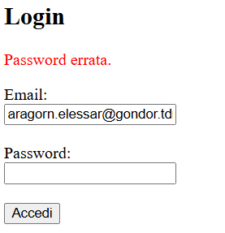

* *Credenziali valide*: Con le credenziali corrette, il sistema autentica l'utente e lo reindirizza alla dashboard corrispondente al suo ruolo (manager).

.Dashboard del manager dopo autenticazione riuscita
image::pics/manager_dashboard.png[align=center,width=80%]

=== Gestione entità di business

Il secondo test verifica la funzionalità di gestione delle entità principali del sistema, in particolare la creazione di nuovi fornitori.

.Interfaccia di gestione negozi e fornitori
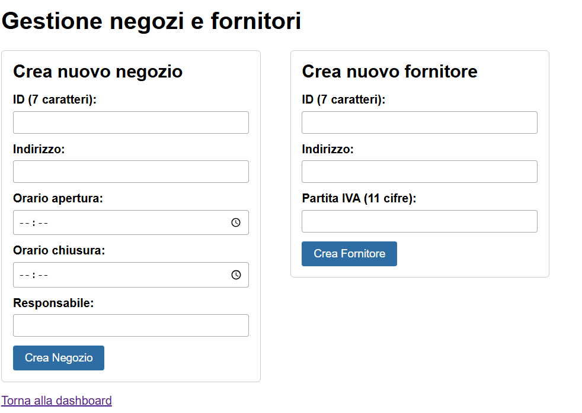

Dalla dashboard del manager, selezionando "Gestione negozi/fornitori", si accede all'interfaccia che permette di creare e gestire queste entità. Il test ha previsto la creazione di un nuovo fornitore con i seguenti dati:

* ID: `1234567`
* Indirizzo: `Appena fuori di casa`
* Partita IVA: `09876543211`

.Inserimento di un nuovo fornitore
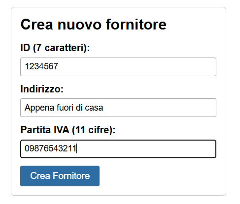

Dopo la conferma, il sistema ha correttamente inserito il nuovo fornitore nel database, come verificato dalla sua presenza nella tabella dei fornitori.

.Verifica dell'inserimento del fornitore
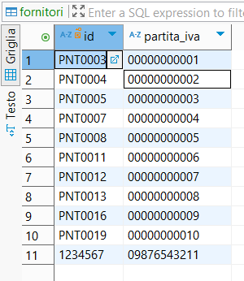

=== Ciclo di approvvigionamento

Il terzo test verifica il ciclo completo di approvvigionamento, dall'inserimento di un ordine fino all'aggiornamento delle disponibilità di magazzino.

Dalla dashboard del manager, selezionando "Ordina prodotti", si accede all'interfaccia che permette di creare ordini per rifornire i negozi. Il test ha previsto la selezione di un negozio (PNT0009) e l'inserimento di quantità per diversi prodotti.

.Interfaccia di rifornimento negozio
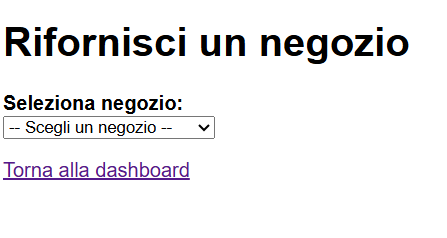

.Inserimento di un nuovo ordine
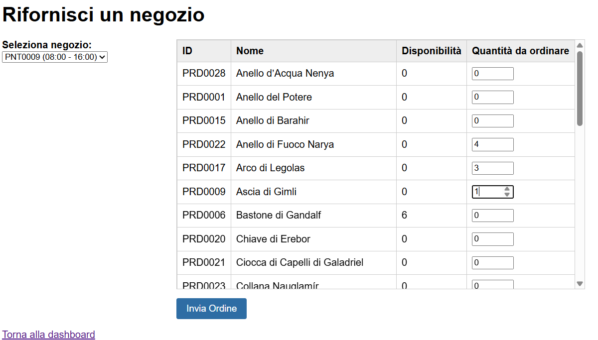

Al completamento dell'operazione, il sistema ha correttamente:

1. Identificato i fornitori ottimali per ciascun prodotto (miglior prezzo con disponibilità sufficiente)
2. Creato gli ordini corrispondenti nel database
3. Mostrato un messaggio di conferma all'utente

.Conferma dell'inserimento dell'ordine
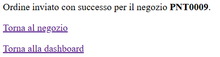

La verifica dell'inserimento è stata effettuata consultando direttamente la tabella degli ordini nel database:

.Verifica dell'inserimento dell'ordine nel database
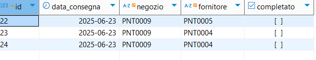

=== Verifica dei trigger di aggiornamento disponibilità

L'ultimo test ha verificato il corretto funzionamento del trigger `aggiorna_disponibilita_al_completamento`, che deve aggiornare automaticamente le disponibilità di magazzino quando un ordine viene completato.

Dopo aver impostato manualmente il flag `completato` a `true` per l'ordine inserito, è stato verificato che le quantità dei prodotti presso il negozio PNT0009 sono state correttamente incrementate, confermando il corretto funzionamento del trigger.

.Verifica dell'aggiornamento automatico delle disponibilità
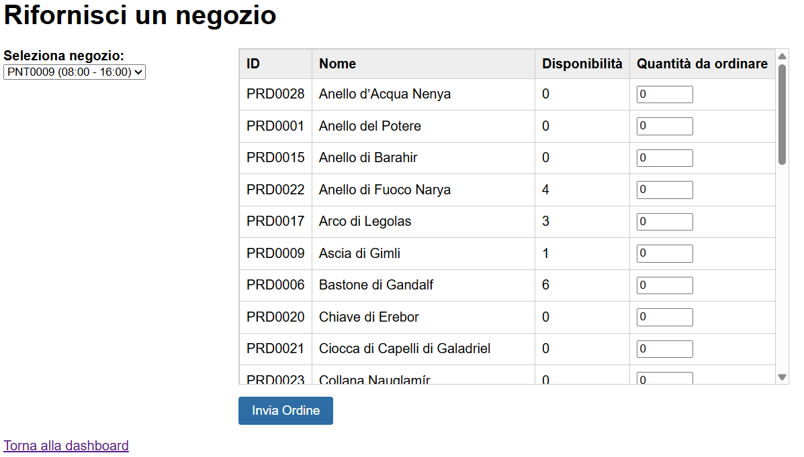

Questo test conferma che il meccanismo di aggiornamento automatico dell'inventario funziona correttamente, garantendo la coerenza dei dati tra gli ordini completati e le disponibilità di magazzino.

=== Gestione clienti e sistema di fidelizzazione

Il quarto test verifica il ciclo completo di gestione clienti, dalla creazione di un nuovo account cliente fino all'utilizzo del sistema di fidelizzazione per ottenere sconti sugli acquisti.

==== Creazione di un nuovo cliente

Dalla dashboard del manager, selezionando "Gestione clienti" e poi "Aggiungi nuovo cliente", si accede all'interfaccia per la registrazione di nuovi clienti nel sistema.

.Interfaccia di creazione nuovo cliente
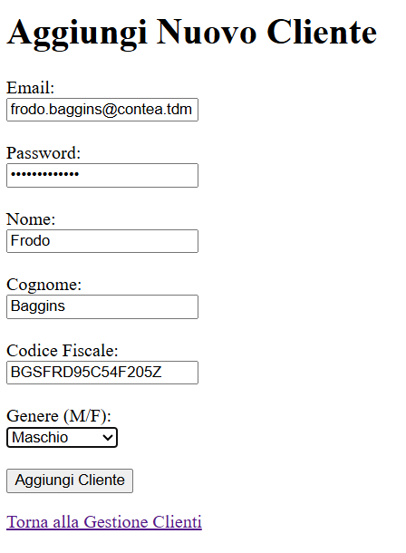

Il form richiede l'inserimento di tutti i dati anagrafici necessari e delle credenziali di accesso. Dopo aver compilato i campi richiesti e confermato l'operazione, il sistema:

1. Verifica l'univocità del codice fiscale e delle credenziali di accesso
2. Crea un nuovo record nella tabella clienti
3. Crea un nuovo record nella tabella utenze con la password opportunamente crittografata
4. Mostra un messaggio di conferma dell'avvenuta registrazione

.Conferma della creazione del nuovo cliente
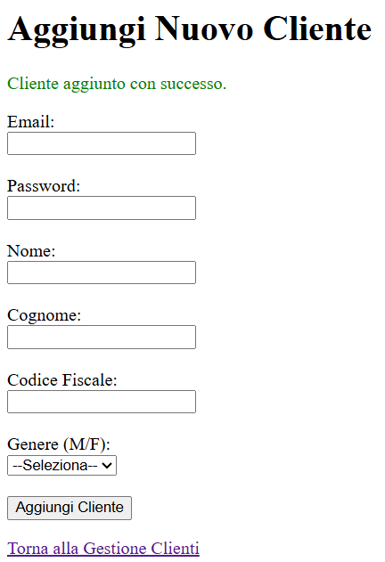

==== Accesso con il nuovo account cliente

Utilizzando le credenziali del cliente appena creato, è stato effettuato l'accesso al sistema. Il sistema ha correttamente:

1. Autenticato l'utente
2. Identificato il ruolo "cliente"
3. Reindirizzato alla dashboard cliente con le funzionalità appropriate

.Dashboard del cliente dopo l'autenticazione
image::pics/login_cliente.png[align=center,width=80%]

La dashboard mostra correttamente un avviso che informa il cliente di non aver ancora richiesto una tessera fedeltà, necessaria per accumulare punti e ottenere sconti.

==== Richiesta tessera fedeltà e primo acquisto

Dalla dashboard del cliente, selezionando "Acquista", si accede all'interfaccia per effettuare acquisti e richiedere la tessera fedeltà.

.Interfaccia di selezione negozio per acquisti
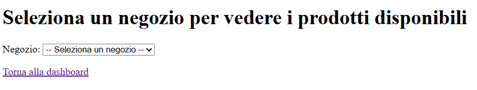

Dopo aver selezionato un negozio, il sistema mostra i prodotti disponibili e offre la possibilità di richiedere una tessera fedeltà. Il test ha previsto:

1. La richiesta di una nuova tessera fedeltà
2. L'acquisto di un prodotto di valore elevato ("Anello del Potere")

.Interfaccia di acquisto con richiesta tessera fedeltà
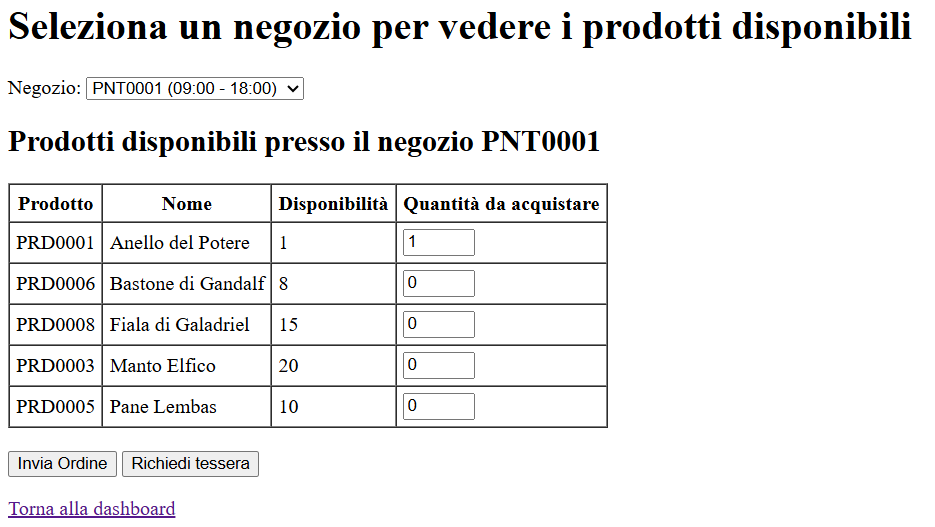

Al completamento dell'operazione, il sistema ha correttamente:

1. Creato una nuova tessera fedeltà associata al cliente
2. Registrato l'acquisto creando una nuova fattura
3. Aggiornato le disponibilità di magazzino
4. Calcolato e assegnato i punti fedeltà in base all'importo speso

.Dashboard cliente dopo l'acquisto con tessera fedeltà
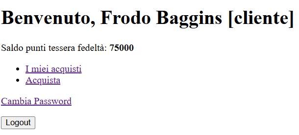

La dashboard mostra ora il saldo punti della tessera fedeltà, confermando il corretto funzionamento del trigger `aggiorna_punti` che incrementa automaticamente i punti dopo ogni acquisto.

==== Acquisto con applicazione di sconto

Avendo accumulato un numero sufficiente di punti (oltre 300), il cliente può ora effettuare un nuovo acquisto applicando uno sconto. Il test ha previsto:

1. La selezione di un negozio
2. L'acquisto di 4 unità del prodotto "PRD0017"
3. L'applicazione di uno sconto del 30% (che richiede 300 punti)

.Interfaccia di acquisto con applicazione di sconto
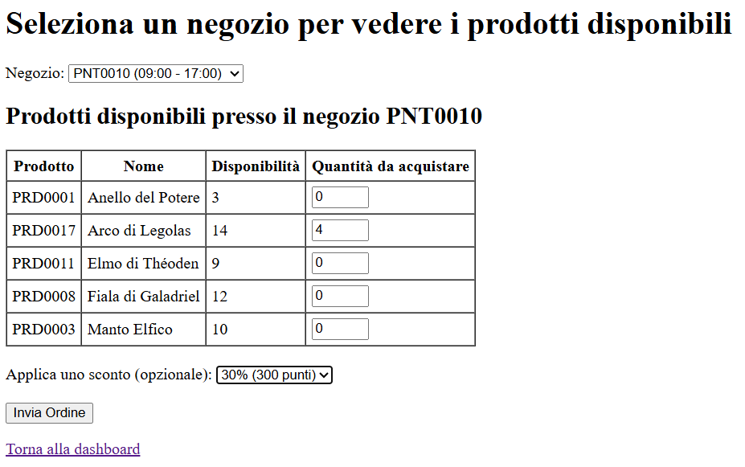

Al completamento dell'operazione, il sistema ha correttamente:

1. Verificato la disponibilità di punti sufficienti
2. Applicato lo sconto del 30% al totale dell'acquisto
3. Scalato i punti utilizzati dalla tessera fedeltà
4. Registrato l'acquisto con lo sconto applicato
5. Aggiornato le disponibilità di magazzino

.Dashboard cliente con riepilogo acquisti
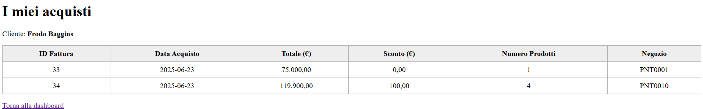

La dashboard mostra ora il riepilogo degli acquisti effettuati, con i dettagli delle fatture e il saldo punti aggiornato. La verifica nel database conferma che tutti i dati sono stati correttamente registrati nelle tabelle `fatture`, `prodotti_fattura` e `tessere`.

