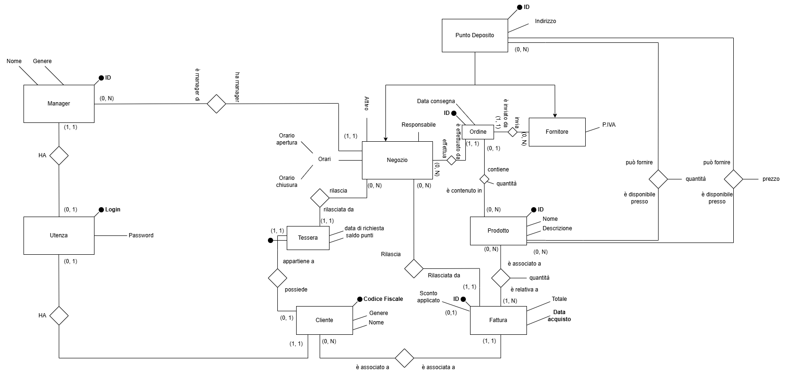
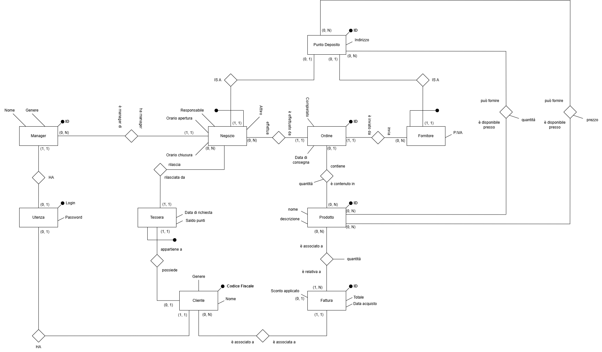

= Documento di analisi

== Luca Casnedi (Matricola 931856)

=== Premesse

Questa è la documentazione del progetto del corso di *Basi di Dati* per l'anno accademico 2024/2025.
L'ambito è quello di una catena di *negozi* presso i quali sono disponibili in vendita *prodotti*
di un tipo non specificato, ogni negozio può vendere prodotti ai *clienti* che ne fanno richiesta. +
I clienti possono fare *acquisti*, richiedere una *tessera fedeltà* presso un negozio per accumulare punti e sbloccare sconti,
possono inoltre visualizzare le *fatture* relative ai propri acquisti. +
I manager possono gestire i negozi inserendo prodotti e decidendo i prezzi dei prodotti nei vari negozi. +
I manager possono inoltre depositare ordini presso fornitori per aumentare la disponibilità dei prodotti nei negozi dove questi sono in esaurimento. +
Sia manager che clienti devono poter cambiare la propria password, i manager possono anche creare utenze per nuovi clienti. +

=== Attori principali e relazioni

In questa sezione esaminerò le scelte fatte per la rappresentazione di questo dominio, avendo come punto di riferimento lo *schema ER* prodotto: +

Nello schema non ristrutturato allegato si possono individuare i principali attori del dominio e le loro relazioni. +
Andando da sinistra verso destra possiamo vedere prima di tutto la tabella *Utenza* utilizzata per registrare le credenziali di uenti e manager.
Le credenziali sono chiaramente associate ad un solo utente (sia esso cliente o manager), e il controllo è forzato lato database
con un trigger che esamineremo. +
Tra *Negozio* e *Manager* la relazione è di tipo _uno-a-molti_, infatti un negozio e gestito da un solo manager
ma un manager può gestire più negozi.  +
Un negozio ha chiaramente degli orari, rilascia zero, una o più tessere ai clienti
(tessere che sono utilizzabili anche presso negozi diversi da quello di rilascio, sono infatti associate
alla catena). +
Un negozio può, inoltre, avere zero, uno o più ordini associati.  +
Il legame tra *Negozio* e *Fornitore* sta negli ordini, un ordine è infatti inviato da un fornitore
ad un negozio e contiene un *Prodotto*.  +

NOTE: L'associazione di un ordine a un solo prodotto è giustificata dal requisito di ottimizzare il prezzo per singolo prodotto.  +

I prodotti sono inoltre associati alle fatture dei clienti. +
Esiste una evidente somiglianza tra le entità *Fornitore* e *Negozio*, queste entità sono chiaramente
dei contenitori di prodotti, disponibili in una certa quantità e acquistabili ad un certo prezzo, aventi un indirizzo.  +
Queste motivazioni mi hanno spinto a creare un'entità superiore *Punto Deposito*, radice di una gerarchia di generalizzazione.  +
Al suo livello è definito l'attributo indirizzo e le relazioni che indicano la disponibilità dei prodotti e il loro
costo presso i vari depositi sono appunto legate a questa entità superiore.  +

A partire da questo schema è stato generato lo schema ristrutturato dove la gerarchia di generalizzazione appena discussa è stata
trasformata mantenendo tutte le entità che la compongono, e utilizzando la relazione *IS_A*. Sono stati inoltre ristrutturati gli attributi composti,
ad esempio _Orari_ dell'entità *Negozio*:

