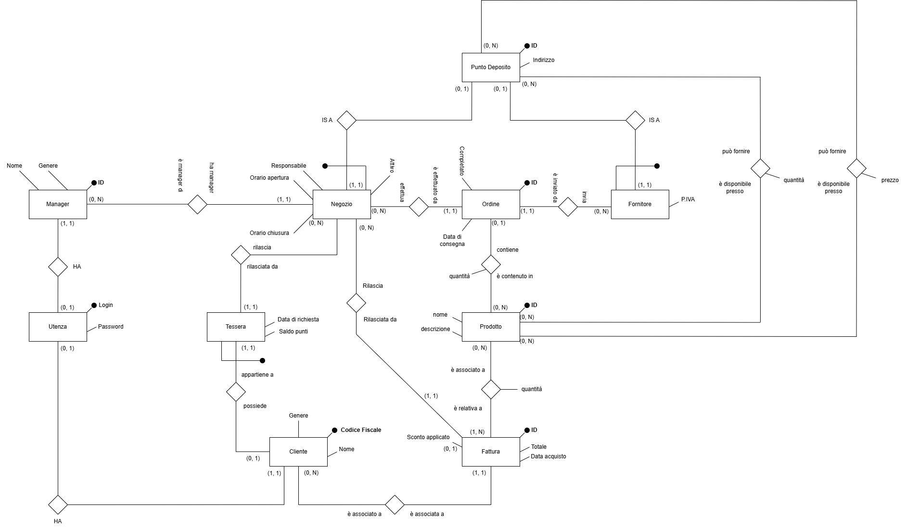

= Documento di analisi

== Luca Casnedi (Matricola 931856)

=== Premesse

La presente documentazione descrive il progetto realizzato per il corso di *Basi di Dati* nell’anno accademico 2024/2025.

Il contesto riguarda una catena di *negozi* presso i quali è possibile acquistare *prodotti* di tipologia non specificata. Ogni negozio può effettuare vendite ai *clienti* che ne fanno richiesta. +
I clienti hanno la possibilità di effettuare *acquisti*, richiedere una *tessera fedeltà* per accumulare punti utili allo sblocco di sconti, nonché visualizzare le *fatture* relative ai propri acquisti. +
I *manager* possono gestire i negozi, aggiungere prodotti e definire i prezzi per ciascun punto vendita. +
Essi possono inoltre effettuare ordini verso i *fornitori* per ripristinare la disponibilità dei prodotti in esaurimento. +
Sia clienti che manager devono poter modificare la propria password, mentre solo i manager sono autorizzati a registrare nuove utenze per i clienti.

=== Attori principali e relazioni

In questa sezione vengono illustrate le scelte progettuali adottate nella modellazione del dominio, facendo riferimento allo *schema ER* prodotto.

+

image::diagrams/schema_er_v1.png[align=center]
+

Lo schema iniziale evidenzia i principali attori coinvolti e le rispettive relazioni. +
Procedendo da sinistra verso destra, si nota l’entità *Utenza*, utilizzata per registrare le credenziali sia dei clienti sia dei manager. Tali credenziali sono associate in modo univoco a un utente, vincolo garantito da un trigger lato database che sarà analizzato successivamente. +

La relazione tra *Negozio* e *Manager* è di tipo _uno-a-molti_: ogni negozio è gestito da un solo manager, mentre un manager può amministrare più negozi. +
Ciascun negozio possiede i propri orari di apertura e può rilasciare una o più *tessere fedeltà* ai clienti. Tali tessere, pur essendo emesse da un determinato negozio, sono valide in tutta la catena. +
Un negozio può inoltre essere destinatario di uno o più *ordini*.

La relazione tra *Negozio* e *Fornitore* è mediata dagli ordini: ogni ordine è infatti inviato da un fornitore a un negozio e riguarda un singolo *Prodotto*.

+

[NOTE]
====
L'associazione di un ordine a un solo prodotto è motivata da un preciso requisito dell'applicazione: i manager devono poter inoltrare ordini per un determinato prodotto verso il fornitore che lo offre al prezzo più vantaggioso. +
Permettere a un ordine di includere più prodotti avrebbe comportato una complessità maggiore, trasformando il problema da un semplice confronto di prezzi a un’ottimizzazione globale del costo complessivo dell’ordine.
====

+

I *prodotti* sono inoltre associati alle *fatture* dei clienti. +
È possibile osservare una chiara somiglianza tra le entità *Fornitore* e *Negozio*: entrambe rappresentano punti di deposito di prodotti, dotati di un indirizzo, in grado di vendere articoli a un determinato prezzo e quantità. +
Per tale ragione è stata introdotta l’entità astratta *Punto Deposito*, posta alla radice di una gerarchia di generalizzazione. A tale livello sono stati definiti gli attributi comuni (come l'indirizzo) e le relazioni relative alla disponibilità e ai prezzi dei prodotti.

A partire da questo schema concettuale è stato prodotto uno *schema ristrutturato*, che mantiene tutte le entità della gerarchia e le connette mediante la relazione *IS_A*. +
Sono inoltre stati ristrutturati alcuni attributi composti, come ad esempio l’attributo _Orari_ dell’entità *Negozio*.

+

+

=== Implementazione Database

